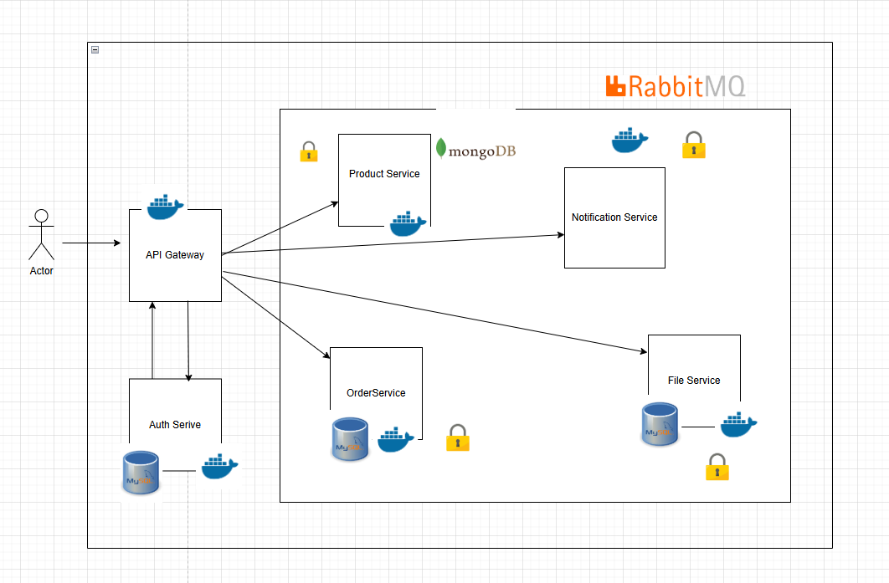

# Microservices Architecture with Docker & Spring Boot

🖼️ Mô hình:  

Link youtube Demo: https://youtu.be/wZL50nhQjRI

## Overview

This is a **real-time microservices** system consisting of **six independent services**, each running in its own **Docker container**. The services communicate internally via **Docker's private network**, with only one **API Gateway** exposed to the external world for request routing.

## Key Features

✅ **6 Independent Microservices**, each handling a specific function  
✅ **Internal Communication** via Docker’s network (**no external API exposure**)  
✅ **API Gateway** – The only entry point for external requests  
✅ **Service Discovery** using **Spring Cloud Eureka**  
✅ **Centralized Configuration** via **Spring Cloud Config**  
✅ **Asynchronous Messaging** with **RabbitMQ**  
✅ **Hybrid Database Support** with **MySQL & MongoDB**  
✅ **Secure Authentication** with **JWT (JSON Web Token)**

---

## Technology Stack

- **Java & Spring Boot** – Backend for microservices
- **Spring Cloud Gateway** – API gateway for routing and security
- **Spring Cloud Eureka** – Service discovery and load balancing
- **Spring Cloud Config** – Centralized configuration management
- **Docker & Docker Compose** – Containerization and orchestration
- **RabbitMQ** – Asynchronous messaging between services
- **MySQL & MongoDB** – Hybrid database solution
- **React** – Frontend for a dynamic UI
- **JWT** – Authentication & authorization

---

## Microservices Structure

1. **API Gateway Service** (Exposed to external requests)

   - Routes requests to internal microservices
   - Handles authentication and security using **JWT**
   - Implements rate limiting, logging, and request validation

2. **User Service**

   - Manages user authentication and authorization
   - Handles **JWT token issuance and validation**
   - Stores user data in **MySQL**

3. **Product Service**

   - Manages product catalog (CRUD operations)
   - Stores product data in **MongoDB**
   - Provides internal API for querying product details

4. **Order Service**

   - Stores order data in **MySQL**
   - Communicates with **Product & Payment Service**

5. **File Service**

   - Processes payments securely
   - Integrates with external payment gateways (if needed)
   - Stores transaction details in **MongoDB**

6. **Notification Service**
   - Sends message notifications
   - Listens to RabbitMQ events

---

## Deployment & Communication Flow

- All services run inside **Docker containers** with **Docker Compose** managing their dependencies.
- Services communicate **internally via Docker’s private network**, ensuring **no external exposure** except for the API Gateway.
- **Spring Cloud Gateway** routes external requests to the correct internal service.
- **RabbitMQ** enables event-driven communication between services.

## Benefits of This Architecture

✅ **Scalability** – Services can be scaled independently based on load.  
✅ **Security** – Internal APIs are **not exposed**, reducing attack surface.  
✅ **Modularity** – Each service is **independent**, making it easier to maintain.  
✅ **Fault Tolerance** – Failure of one service doesn’t affect the entire system.  
✅ **Efficiency** – API Gateway optimizes traffic and security policies.

---

### 🚀 Happy Coding!
